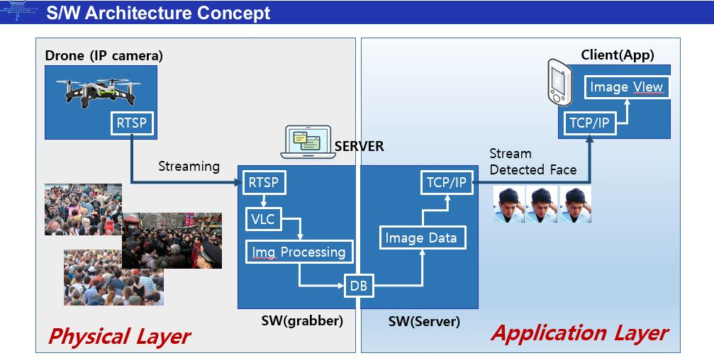
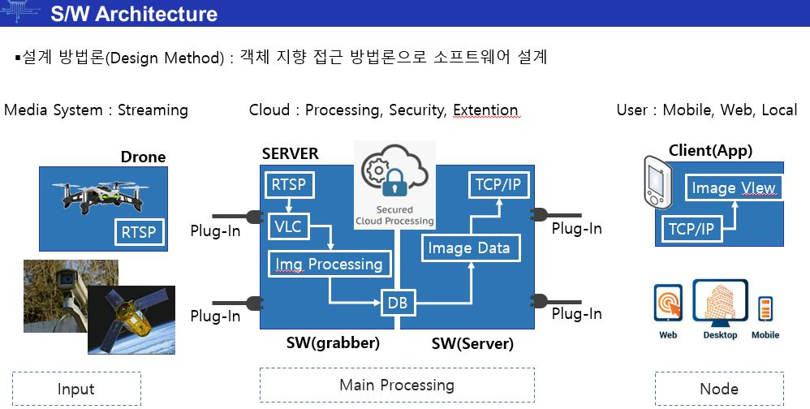
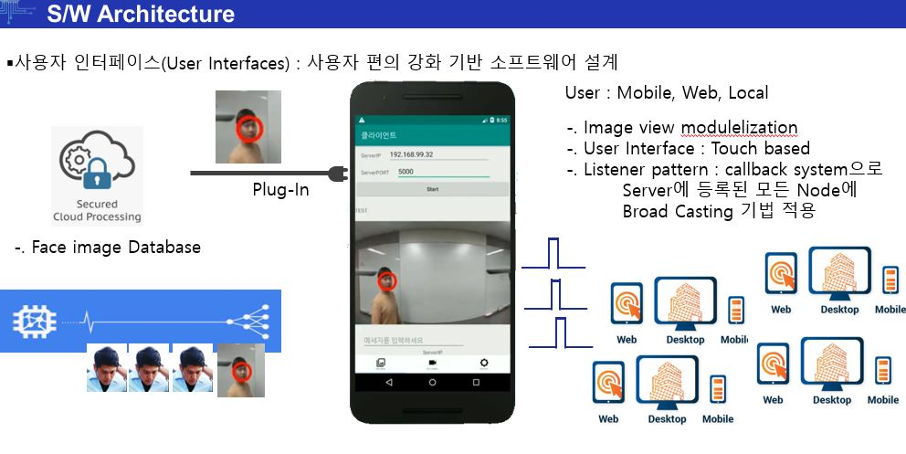

# Drone_OpenCV_Project
드론을 이용한 영상처리 기반의 방범시스템 구축

개발 동기
- 방범 / 보안 / 아동유괴 / 차량내방치 등
- 드론 기반 광범위 기반 보안 강화 시스템 대두

최근 화두가 되고 있는 4차 산업 혁명은 IoT, 빅데이터, AI, 모바일 등의 첨단산업과 기존 산업의 융합을 기반 확대

혁신 사업 분야인 드론은 시장 규모가 폭발적으로 증가

본 프로젝트에서는 드론을 이용한 영상처리 기반의 방범 시스템을 구축 제안

